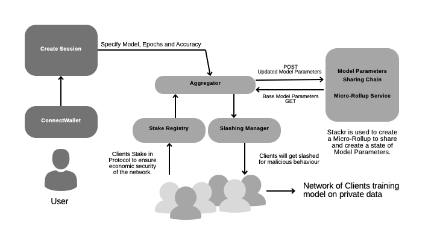

# FedBlocks

A Federated Learning Protocol Secured with Proof of Stake for Enhanced Economic Security. Built with micro-rollups, FedBlocks enables verifiable off-chain computation for state management and incorporates slashing mechanisms to deter malicious actors.

### Federated Learning and its Challenges

Federated Learning offers a privacy-focused method for training deep learning models. Here, data resides in isolated pools, and clients in the network train a model on their local datasets with initial parameters. Each client then shares their updated model parameters with an aggregator, which computes a federated average of these model updates to generate a new base model for the next training round. 

In networks of clients, ensuring honest training is essential for improving model accuracy. However, some clients may attempt to manipulate training, thereby compromising the model’s accuracy. To address this, FedBlocks leverages a **Proof of Stake** framework.

## FedBlocks Architecture

</img>

Users onboard by specifying model requirements, such as target accuracy and number of epochs. The FedBlocks protocol then matches them with a set of clients who possess relevant data to train models. An aggregator handles the federated learning process across this client network. Each client stakes a predetermined `STAKE_AMOUNT` in the `StakingRegistry` contract, which can be slashed by the `SlashingManager` if the client is found acting maliciously, discouraging bad behavior.

To prevent network spam, users are charged a base `BASE_FEE` to start. After the model achieves the desired accuracy, users are billed according to the number of epochs and the cost per epoch. Fees are distributed among the protocol and clients via the `RewardManager` contract.

### Deployed Contracts on Arbitrum Mainnet

| Contract | Address |
|----------|---------|
| [StakingRegistry](https://github.com/BlocSoc-iitr/FLockChain/blob/main/staking_contracts/src/StakingRegistry.sol) | [0x3edc74f276ff9c476a5be63e3a5b20c616e84a43](https://arbiscan.io/address/0x3edc74f276ff9c476a5be63e3a5b20c616e84a43#code) |
| [SlashingManager](https://github.com/BlocSoc-iitr/FLockChain/blob/main/staking_contracts/src/SlashingManager.sol) | [0x122195923d6f6d04ba748628c9678401f6c4340f](https://arbiscan.io/address/0x122195923d6f6d04ba748628c9678401f6c4340f#code) |
| [SlashTreasury](https://github.com/BlocSoc-iitr/FLockChain/blob/main/staking_contracts/src/SlashTreasury.sol) | [0x8709ea3d5680b0de65d716f87721d07c0fc46ff3](https://arbiscan.io/address/0x8709ea3d5680b0de65d716f87721d07c0fc46ff3#code) |
| [RewardManager](https://github.com/BlocSoc-iitr/FLockChain/blob/main/staking_contracts/src/RewardManager.sol) | [0x1fd53deeeb666f07ce0dd2b905535cb45d4294c3](https://arbiscan.io/address/0x1fd53deeeb666f07ce0dd2b905535cb45d4294c3#code) |
| [RewardTreasury](https://github.com/BlocSoc-iitr/FLockChain/blob/main/staking_contracts/src/RewardTreasury.sol) | [0xd2c5b64acfffa8f1377b79d929f781582d95cbf3](https://arbiscan.io/address/0xd2c5b64acfffa8f1377b79d929f781582d95cbf3#code) |

### Micro-Rollup Architecture

FedBlocks uses Stackr to establish a micro-rollup layer on the client network. This layer acts as a Model Parameters Sharing (MPS) chain, recording the model parameter states for each training epoch. This enables verifiable tracking of parameter updates from each client.

The rollup also supports off-chain verifiable computation, where slashing conditions are assessed. The rollup’s State Transition Function manages slashing checks and tracks each client’s model parameters, flagging clients that should be penalized. The aggregator periodically checks this state after each epoch, and if a client exhibits malicious behavior, the aggregator triggers the `SlashingManager` to penalize the client’s stake.

### Slashing Mechanism

The slashing mechanism within FedBlocks verifies model accuracy by examining correlations between base models and updated models. The Krum function assigns scores to clients based on squared distances between their parameter tensors and those of others, assuming most clients are honest. A significant contrast in Krum scores can identify potential bad actors.

FedBlocks also addresses “free riders” — clients who participate without actively training. To discourage this, FedBlocks assesses parameter similarity between training epochs. Clients with minimal improvement face penalties, promoting honest participation in model training.

